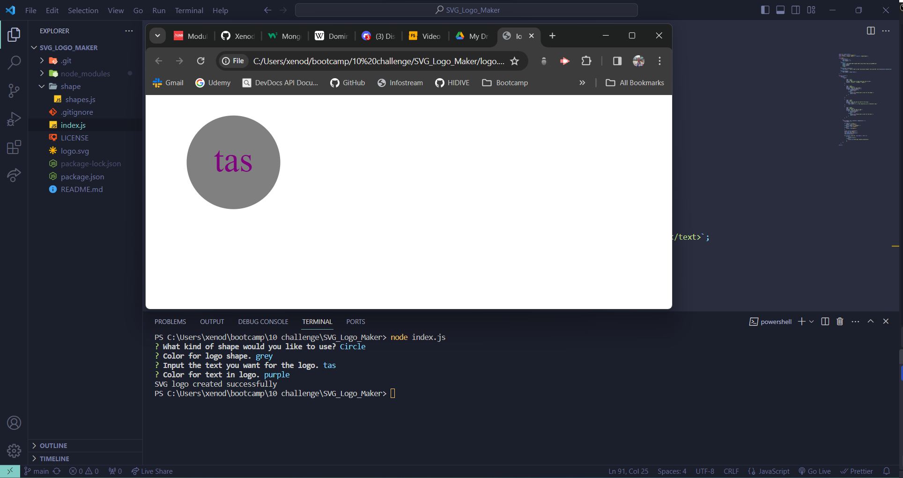

# SVG Logo Maker

## Description

This command-line application is designed to help freelance web developers generate simple logos for their projects without the need for a graphic designer. The application allows users to input text, choose text and shape colors, and select a shape from a predefined list.

## Table of Contents

1. [Description](#description)
2. [Installation](#installation)
3. [Usage](#usage)
4. [Example](#example)
5. [Screenshot](#screenshot)
6. [Video Link](#video-link)
7. [License](#license)

## Installation

1. Clone the repository to your local machine:

   ```bash
   git clone https://github.com/XenodiusAlpha/SVG_Logo_Maker.git
   ```

2. Navigate to the project directory.

3. Install the required dependencies:

   ```bash
   npm install
   ```

## Usage

To run the SVG logo generator, use the following command in the terminal:

```bash
node index.js
```

Follow the prompts to input the desired text, text color, and shape. Once you have entered all the required information, an SVG file named `logo.svg` will be generated in the project directory.


## Example

```bash
node index.js
```

- Enter text: ABC
- Enter text color: blue
- Choose shape: circle
- Enter shape color: #FFA500

Upon completion, the application will generate `logo.svg` and print "SVG logo created successfully" in the command line.

## Screenshot


## Video link
https://drive.google.com/file/d/1PQjn3h6z9TcpX3clJSj1wCCE--xSSITW/view?usp=sharing


## License

This project is licensed under the MIT License - see the [LICENSE](LICENSE) file for details.
